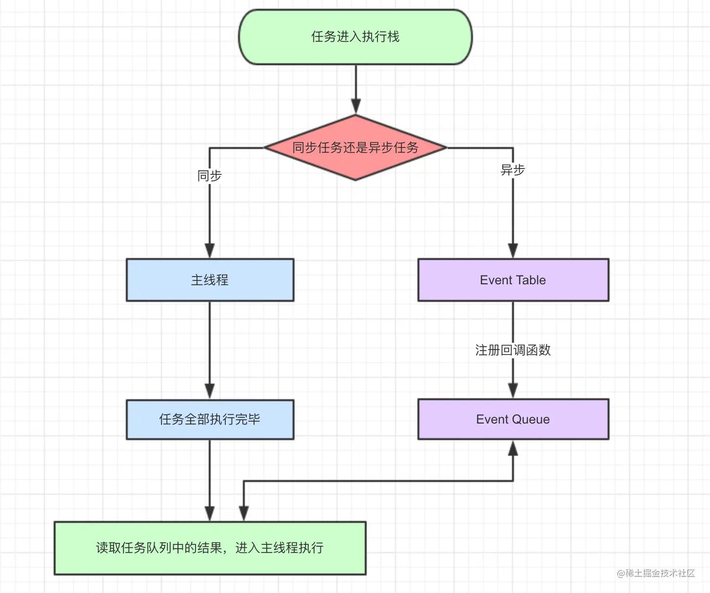
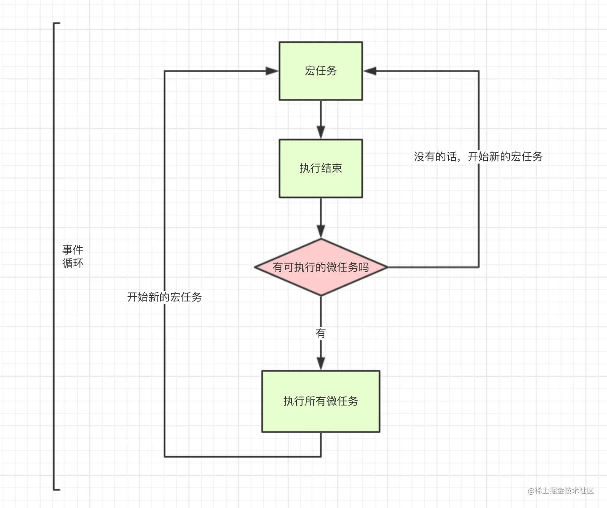

# 浏览器事件循环




## 1. 为什么需要事件循环

JavaScript 在浏览器主线程里是单线程执行的。

这意味着同一时刻只能做一件事:

- 执行一段同步代码
- 响应一次点击事件
- 执行一个 `setTimeout` 回调
- 执行一个 `Promise.then` 回调

如果没有调度机制，异步任务完成后就不知道什么时候回调。事件循环就是浏览器用来协调这些任务执行顺序的机制。

## 2. 先建立一个最小模型

浏览器里的事件循环可以先理解成这 5 个部分:

- `Call Stack` 调用栈: 当前正在执行的同步代码
- `Web APIs`: 浏览器提供的能力，比如定时器、网络请求、DOM 事件
- `Task Queue / Macrotask Queue` 宏任务队列: 存放下一轮要执行的任务
- `Microtask Queue` 微任务队列: 优先级高于宏任务，当前任务结束后立即清空
- 渲染机会: 浏览器在合适时机执行样式计算、布局、绘制

可以先记住一句话:

`同步代码先执行，当前宏任务结束后清空所有微任务，然后浏览器再决定是否渲染，最后进入下一个宏任务。`

## 3. 一轮事件循环的大致过程

### 3.1 简化版流程

1. 取出一个宏任务执行，压入调用栈
2. 执行过程中如果遇到异步 API，比如 `setTimeout`、点击事件、网络请求，就把对应回调交给浏览器
3. 当前宏任务执行完毕，调用栈清空
4. 开始清空微任务队列
5. 微任务清空后，浏览器可能进行一次渲染
6. 再从宏任务队列里取下一个任务执行

### 3.2 要注意的一点

`script` 整体本身也可以看作一个宏任务。

也就是说，页面第一次加载时，整段脚本会先作为一个完整任务执行完，然后才有机会去执行 `Promise.then`、`setTimeout` 这些后续回调。

## 4. 宏任务和微任务

### 4.1 常见宏任务

- 整体脚本 `script`
- `setTimeout`
- `setInterval`
- DOM 事件回调，比如 `click`、`input`
- `postMessage`
- `MessageChannel`

### 4.2 常见微任务

- `Promise.then`
- `Promise.catch`
- `Promise.finally`
- `queueMicrotask`
- `MutationObserver`

### 4.3 谁优先

微任务优先于下一个宏任务。

这句话要理解成:

- 不是“微任务可以打断正在执行的同步代码”
- 而是“当前宏任务执行结束后，必须先把微任务清空，才能开始下一个宏任务”

## 5. 一个最经典的输出顺序题

```js
console.log(1);

setTimeout(() => {
  console.log(2);
}, 0);

Promise.resolve().then(() => {
  console.log(3);
});

console.log(4);
```

输出结果:

```js
1
4
3
2
```

执行过程:

1. `console.log(1)` 是同步代码，立即输出 `1`
2. `setTimeout` 把回调交给浏览器，时间到后进入宏任务队列
3. `Promise.then` 回调进入微任务队列
4. `console.log(4)` 是同步代码，立即输出 `4`
5. 当前脚本这个宏任务结束，开始清空微任务，输出 `3`
6. 微任务清空后，取下一个宏任务，输出 `2`

## 6. 再看一个“微任务插队”的例子

```js
setTimeout(() => {
  console.log("timeout1");

  Promise.resolve().then(() => {
    console.log("micro1");
  });
}, 0);

setTimeout(() => {
  console.log("timeout2");
}, 0);
```

输出结果:

```js
timeout1
micro1
timeout2
```

原因:

- 第一个 `setTimeout` 回调先进入并执行
- 它执行过程中又创建了一个微任务 `micro1`
- 当前这个宏任务结束后，必须先清空微任务
- 所以 `micro1` 会在第二个 `setTimeout` 之前执行

## 7. `setTimeout(fn, 0)` 为什么不是立即执行

`setTimeout(fn, 0)` 的含义不是“马上执行”，而是:

`至少等待 0ms 后，把回调放入宏任务队列，等调用栈空了再执行。`

它不立即执行的原因有 3 个:

- 当前同步代码还没跑完
- 前面可能还有别的宏任务排队
- 当前宏任务结束后还要先清空微任务

所以 `0ms` 只是最短延迟，不是精确执行时间。

## 8. 为什么 `setTimeout` 会有误差

定时器常见误差来源:

- 主线程正在忙，回调只能继续等待
- 微任务太多，导致宏任务迟迟轮不到
- 浏览器标签页切到后台后会降频
- 浏览器对嵌套定时器有最小时间间隔限制

因此 `setTimeout(() => {}, 1000)` 更准确的理解应该是:

`不早于 1000ms 执行`

而不是:

`精确在 1000ms 执行`

## 9. 微任务为什么危险

微任务优先级高，如果不停地往微任务队列里塞任务，页面可能会卡住，甚至来不及渲染。

例如:

```js
function loop() {
  queueMicrotask(loop);
}

loop();
```

这类代码会不断清空又不断补充微任务，事件循环很难进入下一轮，页面会被“饿死”。

结论:

- 微任务适合做当前任务结束后的收尾工作
- 不适合做无穷递归或长时间计算

## 10. 浏览器渲染和事件循环的关系

浏览器不是每执行一行 JS 就渲染一次。

更常见的情况是:

- 执行一个宏任务
- 清空微任务
- 浏览器判断现在是否适合渲染
- 如果适合，就进行一次渲染

这也是为什么:

- 你在一个很长的同步任务里改很多次 DOM，页面不一定立刻更新
- 如果 JS 一直不让出主线程，页面会卡住，按钮点了也没反应

### 10.1 `requestAnimationFrame`

`requestAnimationFrame` 不是普通的定时器，它更适合做动画。

它的回调会在浏览器下一次重绘前执行，特点是:

- 更贴近屏幕刷新节奏
- 页面隐藏时通常会暂停或降频
- 比 `setTimeout` 更适合视觉动画

简单理解:

- 想“过一会再执行”，常用 `setTimeout`
- 想“下次绘制前执行”，常用 `requestAnimationFrame`

## 11. 一段稍完整的执行顺序分析

```js
console.log("script start");

setTimeout(() => {
  console.log("setTimeout");
}, 0);

Promise.resolve()
  .then(() => {
    console.log("promise1");
  })
  .then(() => {
    console.log("promise2");
  });

console.log("script end");
```

输出结果:

```js
script start
script end
promise1
promise2
setTimeout
```

原因:

- 同步代码先执行，输出 `script start`、`script end`
- 第一个 `then` 进入微任务队列
- 当前宏任务结束后，执行微任务，输出 `promise1`
- 第一个 `then` 返回后，第二个 `then` 继续进入微任务队列
- 微任务继续执行，输出 `promise2`
- 微任务全部清空后，才轮到 `setTimeout`

## 12. 面试里容易说错的点

### 12.1 错误说法

`Promise 比 setTimeout 快`

### 12.2 更准确的说法

不是“快”，而是:

`Promise.then` 属于微任务，`setTimeout` 属于宏任务。在当前宏任务结束后，微任务会先于下一个宏任务执行。

### 12.3 错误说法

`setTimeout(fn, 0)` 等于立即执行

### 12.4 更准确的说法

它只是尽快把回调放到后面的宏任务里执行，不会打断当前代码。

## 13. 一句话总结

浏览器事件循环可以浓缩成这句话:

`执行一个宏任务 -> 清空微任务 -> 可能渲染 -> 再执行下一个宏任务`

再补一条最实用的经验:

`Promise.then / queueMicrotask` 往往比 `setTimeout` 更早执行，但微任务过多会阻塞页面刷新。`
